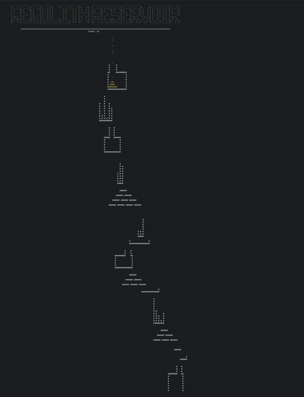

<h1 align="center">Regolith Reservoir</h1>

<h3>
AoC Day14 part 2 Visualizer

</h3>

 

by: <a href="https://lremes.com" target="blanc_">Luciano Remes </a>

### Usage: 
1. `git clone https://github.com/Cybergenik/RR-vis && cd RR-vis`
2. update *input.txt* file with your input
3. go run .
4. watch the ASCII sand :>

### Limitations:
- I bound the grid I generate in ASCII to reduce delay
- Yes, I'm aware of the race condition when drawing the grains
- It's ASCII, and inputs are about 600 in length on the x axis, so you'll need a large display

*accepting PRs!*

